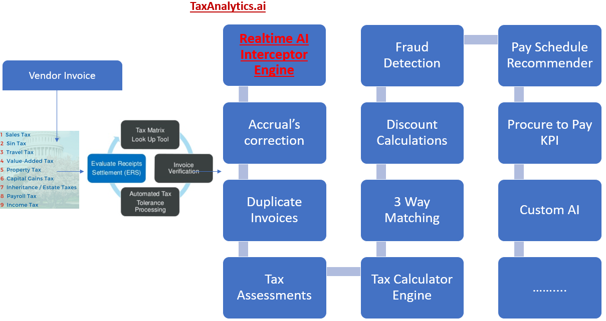

# TaxAnalytics.jl

[documentation](https://amitxshukla.github.io/TaxAnalytics.jl/)

TaxAnalytics julia package provide a **unified Analytics platform** to support data analytical operations on all sort of Vendor, Use, Freight, Misc Tax Accruals data.

**Objective:** TextAnalytics package is one complete solution to address complete Tax data wrangling operations.

This package will provide a complete Analytic Software package, which can be deployed as a bolt-on or independent application for all data extract, load, transformation, ad-hoc reporting, analytics, visualizations and tooling to support Data Science, AI, ML predictive analytics.

This package is intended for small, medium, large and very Big Organizations who require a Big Data Tools which can ELT i.e. Extract very large amount of structured and unstructured data, load data into a uniform platform such as RDBMS, Hadoop Data Lake or non-SQL environment.

    **Platform:** Oracle OCI, AWS, Google or Microsoft Azure data cloud.

    **Analytics:** Power BI, Tableau, Oracle Analytics Cloud or Kibana

    **ELT/ETL:** Ascential Datastage, Informatica, Ab Initio

    **Programming/Framework:** Python, Julia, JuliaDB, Pytorch, TensorFlow or Flux

Further, advance data transformation wrangling techniques can be applied to prepare data for operations reporting, data analytic, advance data visualizations, data science operations including AI, ML for predictions.

This package also show case reporting, visualizations to support real time, live reporting on all mobile, web devices. 

    **Author:** Amit Shukla

    **Last Update Date:** Jan 25, 2021

    **Who should read this:** small, medium, large ERP Consultants

    **Version:** 0.22

    **Consulting:** info@elishconsulting.com

    **Sponsorship:** open for funding

---

Business Process diagram

Technical Process Diagram

---

**Table of Contents:**

- About Taxes
- ETL or ETL
- self service data analysis
- Data Visualization
- Data Science Operations
- p-value Null hypothesis tests
- Feature Engineering
- ML Models
- Live Reporting
- Predictive analytic

    **ERP Systems**
    Oracle, PeopleSoft, SAP, Tally, Intuit, QuickBooks etc.
    I will cover examples from ERP Domains like GL (General Ledger), AP (Accounts Payable), AR (Account Receivables), B2P (Buy to Pay), Expense, Travel & Time, HCM Human Capital Management, CRM etc.
